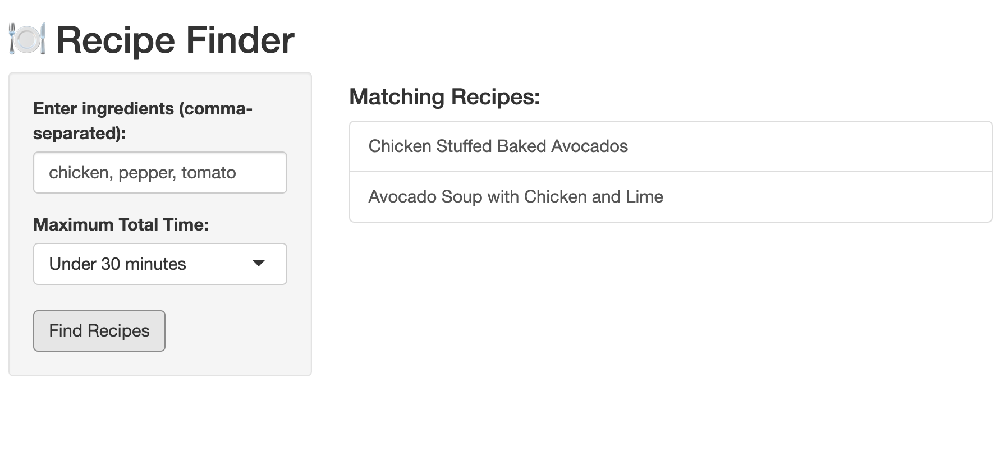
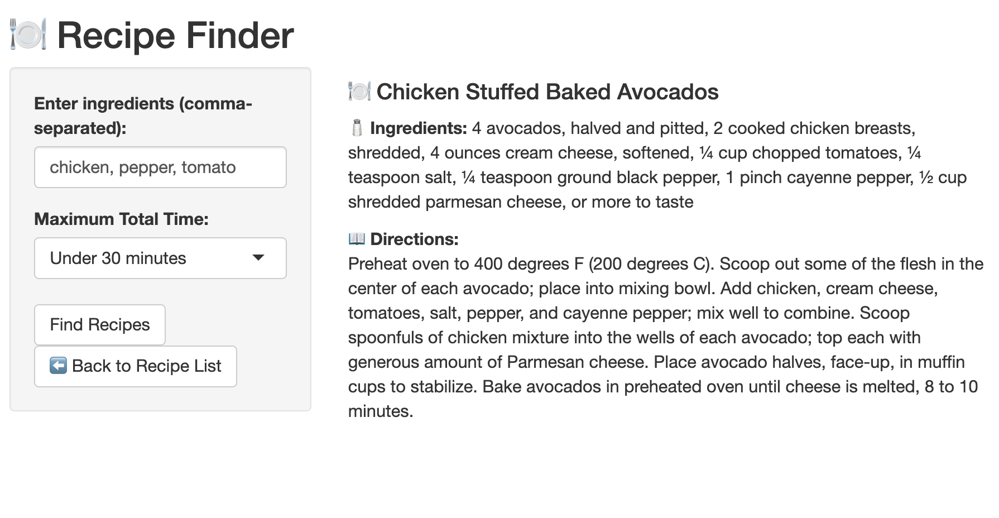

```{r, include = FALSE}
knitr::opts_chunk$set(
  collapse = TRUE,
  comment = "#>"
)
```

```{r setup}
library(recipefinder)
```


## What is "recipefinder"?

"recipefinder" is an R package that helps you find recipes based on ingredients you already have at home. It uses a recipe database ("Recipes.csv") included in the package and returns meal suggestions based on what you input. 

It is made to reduce food waste and inspire you with what is already in your fridge.

## Shiny App

The package also includes an interactive Shiny app which allows users to:

- Enter ingredients they have at home
- Filter recipes by total cooking time
- View matching recipe titles
- Click on a title and see the rest of the ingredients and directions

The app can be easily ran with recipefinder::startApp().

## Shiny App Preview

Below are the screenshots of the 'recipefinder' Shiny interface:





## Basic Usage 

To show all available recipes from the dataset: 
```{r}
head(recipes_list(), 3)
```

To find recipes based on the ingredients you have:
```{r}
head(find_recipes(
  ingredients = c("chicken", "flour", "pepper"),
  file = system.file("extdata", "Recipes.csv", package = "recipefinder")
), 3)
```

## How it works

- The Recipes.csv file contains the titles of the recipes, full ingredient lists and directions. 
- The find_recipes() function matches the input ingredients with the recipes from Recipes.csv file, and outputs the matched titles of the recipes, their full ingredient lists and directions.
- The recipes_list() function lists all recipe titles stored in the database.
